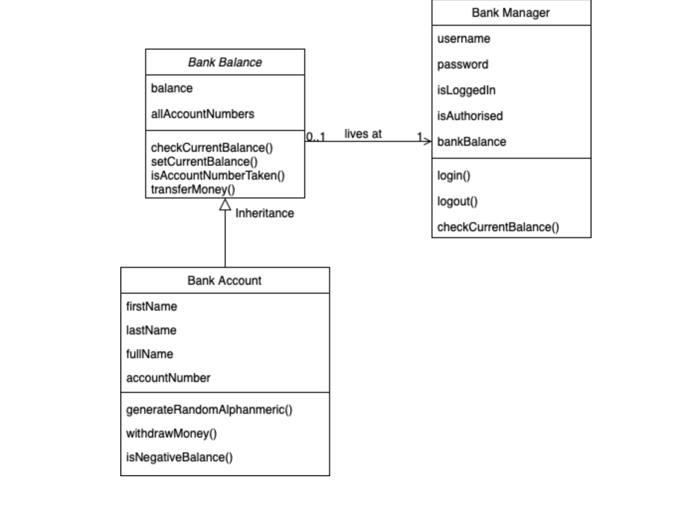

# cooee-tech-assignment

## Overall Architecture

The framework design is composed of three object classes: `BankManager`, `BankBalance`, and `BankAccount`. 

The `BankManager` object class stores the user for the person to be able to login and log out. This object instance is the only one that is qualified to view the overall balance of the Bank, from the `BankBalance` object instance class. The `BankManager` class has one of the properties called `bankBalance`, which is stored using the `BankBalance` object datatype.

The `BankBalance` and the `BankAccount` object classes are essentially connected to each other. `BankBalance` is the child class of `BankAccount` parent class, and its properties are inherited by the child class. These two classes are connected to each other since they have similar properties that can be shared or tweaked in a way, depending on its usage. For instance, the `balance` property from the `BankBalance` class is defined to be used for the overall Bank Balance amount that is stored within the bank, while the same property from the `BankAccount` class, on the other hand, stores the individual balance of each bank account being made.

## How to Install the Framework

1. Make sure `npm` is installed. If not, you can [check this website](https://docs.npmjs.com/downloading-and-installing-node-js-and-npm) on how to install `npm`.
2. Once `npm` is installed, open terminal and type `npm install` to install dependencies specified under `package.json`

## How to run the Framework Tests

1. Make sure that all depencies, specified above are installed.
2. Open terminal and type `npm run build` to build it to run, since it uses `commonjs` as another dependency to make the tests run.
3. Then type `npm run tests`.
